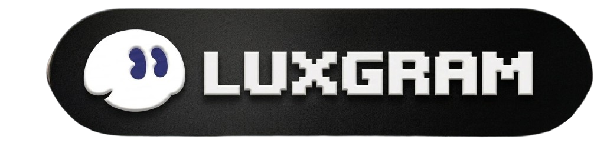
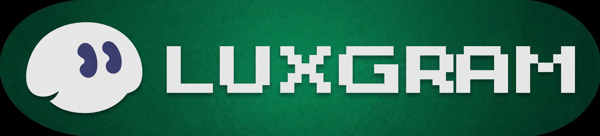

<div align="center">


# LuxGram

**Next-level Telegram client for iOS**

[](https://apple.com/ios)
[](https://swift.org)
[](https://telegram.org)
[](LICENSE)
[](../../actions)

<br/>


&nbsp;&nbsp;&nbsp;


</div>

---

## ✨ Features

| Feature | Description |
|---------|-------------|
| 👻 **Ghost Mode** | Hide online status — broadcasts offline every 5 sec |
| ⏱ **Ghost Delay** | Messages appear sent but server gets them after 12–45 sec |
| 🚫 **No Read Receipts** | Disable message & story read receipts, per-contact whitelist |
| 🚫 **No Ads** | Block all sponsored messages in channels |
| 💎 **Local Premium** | Unlock premium UI limits (folders, pins, emoji) locally |
| 🔒 **Chat Password** | Per-chat password protection |
| 🕳 **Double Bottom** | Hidden accounts behind a secret passcode |
| 💬 **Deleted Messages** | Auto-save deleted messages before they vanish |
| 🎨 **Font Replacement** | Replace Telegram's font app-wide (.ttf import) |
| 📍 **Fake Location** | Spoof GPS via CLLocationManager swizzling |
| 🔊 **Voice Morpher** | Change voice: Anonymous / Female / Male / Child / Robot |
| 📤 **Chat Export** | Export history to JSON, TXT or HTML |
| 🌊 **Liquid Glass** | iOS 26 frosted glass on all nav bars, tabs and toolbars |
| 🎭 **Fake Profile** | Show custom name/photo to yourself locally |
| 🔌 **Plugins** | Install & run custom JS plugins |
| ⭐ **Local Stars** | Custom Stars balance display |

---

## 📱 Badges

Pick your notification badge in **LuxGram → Settings → Badge**:

<div align="center">
&nbsp;&nbsp;&nbsp;
</div>

---

## 🛠 Build

### Requirements

| Tool | Version |
|------|---------|
| macOS | 14+ |
| Xcode | 16+ |
| JDK | 21 (system, set `JAVA_HOME`) |
| Python | 3.11+ |

### 1 — Clone

```bash
git clone --recursive https://github.com/LuxGram/LuxGram-iOS.git
cd LuxGram-iOS
```

### 2 — Configure signing

Edit `build-system/ipa-build-configuration.json`:

```json
{
  "bundle_id": "com.yourteam.LuxGram",
  "api_id": "35971841",
  "api_hash": "504a05393f81633f94c433502e9b09e6",
  "team_id": "YOUR_APPLE_TEAM_ID"
}
```

Place your provisioning profile:

```
build-system/real-codesigning/LuxGram.mobileprovision
```

### 3 — Build

```bash
# Production IPA
./scripts/buildprod.sh

# Custom build number
./scripts/buildprod.sh --buildNumber 100001

# Clean build
./scripts/buildprod.sh --clean

# Simulator (no device needed)
./scripts/buildsim.sh
```

IPA appears in `build/artifacts/`.

---

## ⚡ GitHub Actions (CI/CD)

Push to `main` → IPA built automatically.

**Add these Secrets** in repo **Settings → Secrets and variables → Actions**:

| Secret | How to get |
|--------|-----------|
| `CERTIFICATE_P12_BASE64` | `base64 -i YourCert.p12 \| pbcopy` |
| `CERTIFICATE_PASSWORD` | Password from Keychain |
| `PROVISIONING_PROFILE_BASE64` | `base64 -i LuxGram.mobileprovision \| pbcopy` |
| `APPLE_TEAM_ID` | Your 10-char Apple Team ID |

After push — go to **Actions** tab, download IPA from the build artifacts.

---

## 🗂 Structure

```
LuxGram-iOS/
├── LuxGram/            LuxGram-exclusive modules
│   ├── SGLocalPremium/ Local Premium emulation
│   ├── DoubleBottom/   Hidden accounts
│   ├── ChatPassword/   Per-chat passwords
│   ├── VoiceMorpher/   Voice presets
│   └── GLESettingsUI/  18 settings controllers
├── LuxGram/          Base LuxGram layer (~50 modules)
│   ├── SGSimpleSettings/ 150+ UserDefaults keys
│   └── SGSettingsUI/   Main settings UI
├── submodules/         Telegram iOS (patched)
├── AppBadges/          Selectable notification badges
└── Icons/              App icon assets
```

---

## 📬 Community

<div align="center">

[](https://t.me/luxgramios)
[](https://t.me/luxgramios_chat)

</div>

---

<div align="center">
<sub>Based on <a href="https://github.com/LuxGram/Telegram-iOS">LuxGram</a> · <a href="https://github.com/TelegramMessenger/Telegram-iOS">Telegram iOS</a> · GPL-2.0</sub>
</div>
